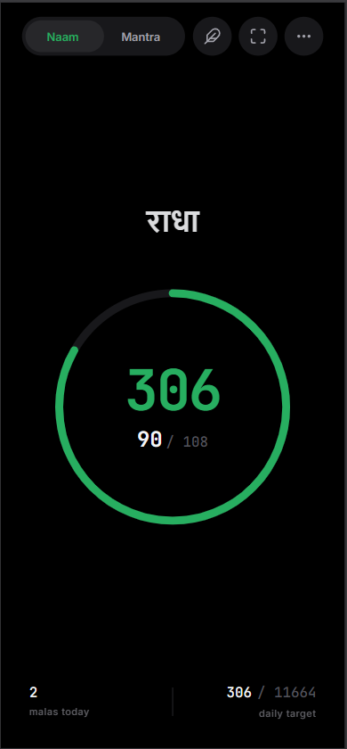
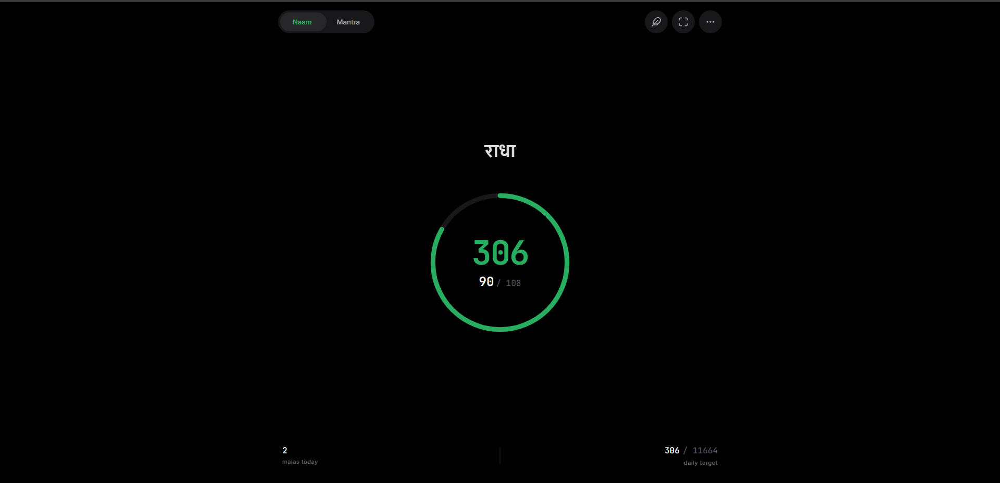

# 📿 RadhaSmaran

**A minimalist, offline-first digital sanctuary for Japa counting and Likhita meditation.**

 

> *RadhaSmaran is not just a tracker; it is a serene, distraction-free environment built to honor the practice of Naam Japa. No ads, no tracking, no cloud lock-in. Just you and the Divine Name.*

[**Live Demo**](sujoyonweb.github.io/radhasmaran) • [**Report a Bug**](https://github.com/sujoyonweb/radhasmaran/issues) • [**Request Feature**](https://github.com/yourusername/radhasmaran/issues)

---

## 📱 The Experience

*(Note: Replace these placeholder links with actual screenshots of your app!)*

  
  &nbsp; &nbsp; &nbsp; &nbsp;
  

## ✨ Key Features

* 🖋️ **Likhita Canvas:** A mathematically precise, full-screen digital writing space. Trace the Divine Name with your finger or mouse. Features a custom stylus reticle and smooth, meditative ink fading.
* 📿 **Dual-Mode Tracking:** Seamlessly switch between *Naam* (short) and *Mantra* (long) counting modes with independent lifetime tracking and target goals.
* 📊 **Deep Insights & History:** Visualize your spiritual journey with a 30-day logbook, weekly bar charts, monthly heatmaps, and a lifetime *Maha Sankalpa* tracker.
* 🔔 **The Divine Audio Engine:** Engineered using the native Web Audio API to synthesize a resonating 432Hz brass temple bell upon completing a Mala (108 counts).
* 📴 **100% Offline PWA:** Built with an elite Dual-Tier Service Worker. RadhaSmaran installs instantly on iOS, Android, macOS, and Windows. It works flawlessly in airplane mode.
* 🛡️ **Mathematical Data Sync:** Features a bulletproof "High-Water Mark" (`Math.max`) JSON backup engine. Safely restore your data across devices without ever duplicating or losing a single count.

---

## 🛠️ Technical Architecture

RadhaSmaran was built with a strict adherence to **Vanilla Web Technologies**. No React, no Vue, no bloated NPM modules. 

* **The DOM Engine:** Zero-dependency, lightweight JavaScript utilizing `requestAnimationFrame` for buttery-smooth CSS transitions.
* **Swipe Physics:** A custom-built, glitch-free Touch Physics engine that mimics native iOS/Android bottom-sheet dismissal.
* **Dual-Tier Cache:** The Service Worker (`sw.js`) intelligently sorts heavy assets (Calligraphy fonts, SVG icons) into a permanent core vault, while keeping HTML/JS in an active, easily updatable cache.
* **Responsive Design:** 100dvh mobile-first design that elegantly expands into floating, macOS-style drop-shadow modals on desktop screens (`>768px`).

---

## 🚀 How to Install (As a Native App)

Because RadhaSmaran is a Progressive Web App (PWA), you don't need an App Store to install it. 

### iOS (iPhone & iPad)
1. Open the live app in **Safari**.
2. Tap the **Share** button at the bottom of the screen.
3. Scroll down and tap **"Add to Home Screen"**.

### Android
1. Open the live app in **Chrome**.
2. Tap the **Three Dots (Menu)** in the top right.
3. Tap **"Install App"** or "Add to Home Screen".

### Desktop (Windows & Mac)
1. Open the live app in **Chrome or Edge**.
2. Look for the install icon (a monitor with a downward arrow) in the right side of the URL address bar.
3. Click **Install**. The app will now run in its own standalone window!

---

## ⌨️ Desktop Keyboard Shortcuts

Power users on Desktop can utilize the following shortcuts for a seamless experience:
| Key | Action |
| :--- | :--- |
| `Spacebar` / `Enter` / `Arrows` | Safely ignored (Prevents accidental machine-gun counting) |
| `F` | Toggle Fullscreen Immersive Mode |
| `Escape` | Instantly close any open settings menu or modal |
| `Mouse Click` | Increment count / Draw on Likhita Canvas |

---

## 🤝 Contributing

Contributions, issues, and feature requests are welcome! 
Since this is a deeply personal and spiritual tool, all code contributions should align with the core philosophy: **Minimalism, Privacy, and Performance.**

1. Fork the Project
2. Create your Feature Branch (`git checkout -b feature/AmazingFeature`)
3. Commit your Changes (`git commit -m 'Add some AmazingFeature'`)
4. Push to the Branch (`git push origin feature/AmazingFeature`)
5. Open a Pull Request

---

## 📜 License

Distributed under the **MIT License**. See `LICENSE` for more information.

 

  <i>Built with devotion and Vanilla JS.</i>

